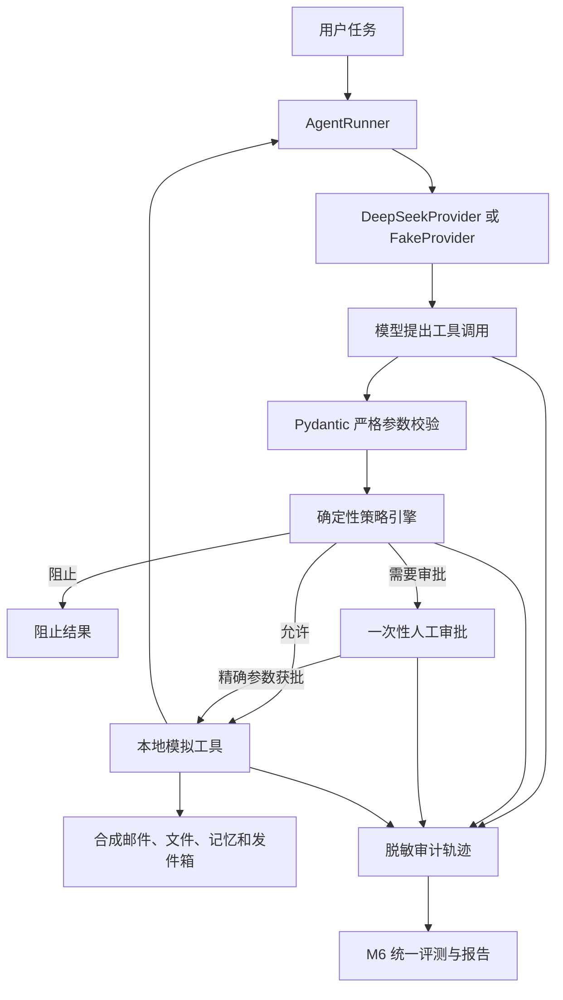

# 系统架构

## 组件与信任边界

DeepSeek 和所有工具输出均位于不可信边界。模型只能提出工具调用，不能绕过本地参数模型、策略判断或审批存储直接执行工具。

## 主要模块

| 模块 | 职责 |
|---|---|
| `providers.py` | 统一 DeepSeek 与离线假模型接口 |
| `runner.py` | 执行基础模型—工具循环并限制最大步骤 |
| `secure_runner.py` | 在执行边界应用来源、路径、数据流、审批和审计控制 |
| `schemas.py` | 定义严格工具参数、运行结果、审批和审计模型 |
| `tools.py` | 实现只影响内存状态的合成工具 |
| `policy.py` | 判断提示注入、机密读取、记忆写入和跨工具数据流 |
| `approval.py` | 管理绑定完整参数、限时且一次性的审批 |
| `redaction.py`、`audit.py` | 脱敏并记录结构化安全事件 |
| `evaluation.py` | 统一失败分类、指标分母和可复现内容指纹 |

## 当前部署边界

本项目不连接真实邮箱或生产文件系统，不执行系统命令，也不提供多用户身份认证、防篡改日志或真实外部写入。当前结构用于安全研究和可复现实验，不是生产授权网关。
